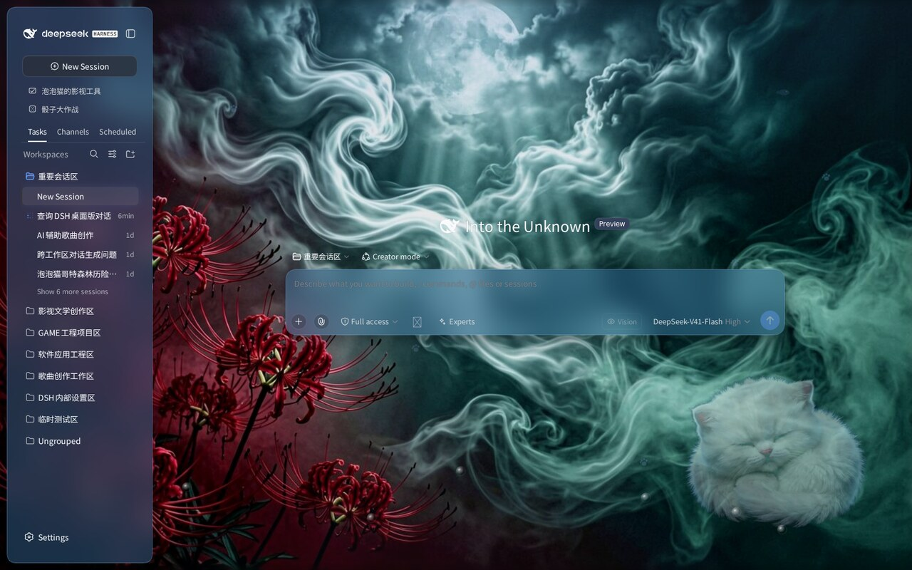
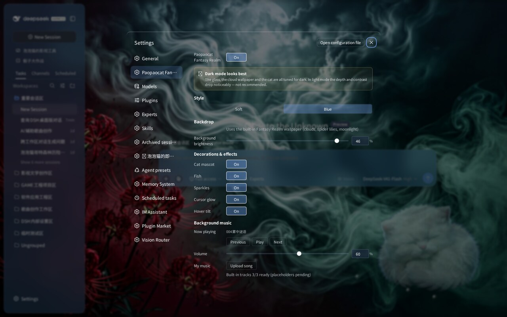
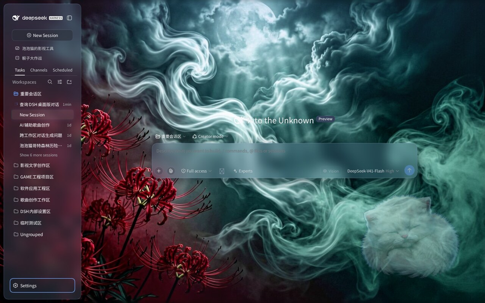

# 🐱 泡泡猫的奇幻之境主题 · dsh-client-ui-paopaocat

为 DeepSeek Harness Web 界面打造的**奇幻之境**主题皮肤：月光下的冥界森林，彼岸花在脚下盛开，流云在头顶缓慢漂移，一只睡着的小猫趴在角落，小鱼在界面里游动。

> **适配版本** — DSH `0.1.5-rc.1`



## 奇幻之境视觉

一片被月光泡透的森林，青绿色的流云缓缓翻涌，绯红的彼岸花从屏幕左下角蔓延上来，一只白色毛绒小猫在右下角安然入睡——界面不再是容器，而是泡泡猫的梦境现场。

| 元素 | 说明 |
|---|---|
| 🌸 **彼岸花** | 左下角成簇的绯红石蒜，花瓣细长舒展，是全主题最强的视觉锚点 |
| ☁️ **流云** | 青绿色烟雾状云层持续翻涌流动，撑起整个画面的纵深感 |
| 🌙 **月光** | 画面顶部的冷白光晕，为森林提供唯一光源 |
| 😺 **睡着的小猫** | 右下角趴卧的白色毛绒猫，随主题呼吸般微微起伏 |
| 🐟 **小鱼** | 侧边栏与装饰层中的卡通小鱼，游动点缀 |
| ⭐ **星光** | 细碎光点漂浮，密度可调 |

## 双风格一键切换

设置面板顶部「风格」分段控件，**淡雅** / **蓝色** 实时切换：

- **淡雅**：极淡冰蓝白底（`#F5F9FC → #FFFFFF`），玻璃近乎透明，装饰极克制 —— 宁静、留白、高字体反差
- **蓝色**：饱和蓝白流体（`#87CEEB → #F0F8FF → #E0F7FA`），猫爪、泡泡、小鱼、星光装饰饱满 —— 活泼、有存在感



## 特性

- **WebGL2 流体背景**：三色渐变 + 噪声 + 漩涡 + 鼠标交互，色调与深浅可调
- **自由背景**：流体，或壁纸（内置一张默认壁纸，也可自定义图片/视频；含模糊、磨砂、亮度调节）
- **品牌装饰**：猫爪印、小鱼、彩色泡泡、星光、趴卧小猫剪影
- **双模式**：**云母效果**把布局改成悬浮玻璃卡片；**兼容模式**保持原版排版，只换材质
- **中/英文字体自定义**
- **一键开关**：关闭即完全还原原生界面，不改 DSH 任何一行源码



## 🎵 背景音乐

主题内置唯美背景音乐，可边写代码边听。

- **内置 3 首曲目**（随包内置，开箱即听）：`004雾中谜语`、`测试`、`泡泡猫`
- **支持上传自己的音乐**：设置面板选择任意本地音频文件（`audio/*`），存入浏览器 IndexedDB，可随时删除
- **完整播放控制**：上一首 / 播放暂停 / 下一首 / 音量，列表循环播放

> 用户上传的音乐只保存在本机浏览器中，不会随插件分发。

## 安装

```sh
dsh plugin --profile web add dsh-client-ui-paopaocat
```

刷新 Web 界面即可。关闭开关回到原生界面。

### 本地开发安装

```sh
git clone https://github.com/zmm863-commits/dsh-client-ui-paopaocat
cd dsh-client-ui-paopaocat
npm install
npm run build          # tsdown + ModuleLoader 包装 + smoke test
dsh plugin --profile web add "$(pwd)"
```

## 设置项

| 分组 | 控件 |
|---|---|
| 总开关 | 开启 / 关闭 |
| **风格** | 淡雅 / 蓝色 |
| 模式 | 云母效果 / 兼容模式 |
| 玻璃材质 | 模糊度 0–40px · 磨砂度 0–100% · 代码块磨砂度 0–100% |
| 背景 | 流体 / 壁纸；流体含色调 0–360° 与深浅 0–100%；壁纸支持图片与视频 |
| 环境装饰 | 猫角色 · 小鱼 · 星光 |
| 悬停效果 | 鼠标辉光 · 悬停下压 |
| **背景音乐** | 内置 3 首 · 上传自己的音乐 · 上一首/播放/下一首 · 音量 |
| 字体 | 英文字体 · 中文字体 |

## 架构

```
src/
├── index.ts                  Host 半边（空实现，纯客户端主题）
└── client/
    ├── index.ts              入口：locale 注册 + settings.section 挂载
    ├── ppc-layer.ts          核心层：生命周期 / CSS 变量 / 流体 / 场景 / 辉光
    ├── ppc-preset.ts         双风格参数（淡雅 / 蓝色）
    ├── ppc-fluid-shader.ts   WebGL2 流体着色器
    ├── ppc-fluid-tones.ts    HSL 调色板生成
    ├── ppc-ambient-scene.ts  装饰场景组装
    ├── ppc-brand-assets.ts   猫爪 / 小鱼 / 泡泡 / 星光 / 猫角色 SVG
    ├── ppc-music.ts          背景音乐播放器（内置曲目 + 用户上传）
    ├── ppc-settings-row.tsx  设置面板 UI
    └── ppc.css.ts            全局样式（属性 gating）
```

技术要点：
- 全部样式经 `[data-ppc]` 属性 gating，卸载即还原
- 客户端 bundle 为单文件 CJS，由 `build.mjs` 包装为 `window.__ModuleLoader__.load({ id, factory })`
- React 通过 factory 的 `require` 获取，无动态 import
- 内置音乐由 `build.mjs` 在构建期转为 data URL 注入，运行时无需额外请求
- `npm run build` 内置 headless smoke test，失败即构建失败

## 素材来源

- 奇幻之境背景壁纸：由 **Agnes 图像 API**（`agnes-image-2.1-flash`）生成，月光森林 + 彼岸花 + 白虎斑猫主题
- 猫爪、小鱼、泡泡、星光、趴卧小猫：本插件自绘的内联 SVG（跟随主题色）
- 内置背景音乐：作者原创曲目

## 许可

MIT
